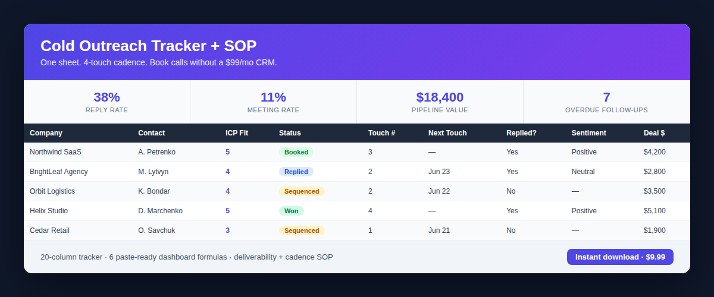

# Cold Outreach Tracker (Free)

A free, no-CRM, single-sheet system for running cold outreach that actually books calls.
Import the CSV into Google Sheets or Excel and you have a working pipeline in 5 minutes.

## What's here (free)
- **`cold-outreach-tracker.csv`** — a 20-column tracker built around the only metrics that move
  revenue: ICP fit, a 4-touch cadence, reply sentiment, booked calls, and pipeline value.
- **Quickstart** below — enough to run it today.

## Quickstart
1. Google Sheets → File → Import → Upload `cold-outreach-tracker.csv` → "Replace spreadsheet".
2. Freeze row 1 (View → Freeze → 1 row).
3. Add a dropdown on `Status`: `New, Sequenced, Replied, Booked, Won, Lost, Bounced`.
4. Work the loop: every contact gets `ICP Fit` (1–5, never send to a 1–2), and every time you
   send, set `Next Touch Date`. The sheet's whole job is making sure nobody falls through the
   cracks — that's where most pipeline leaks.

## The 4-touch cadence (the part beginners skip)
1. **Touch 1 — the ask.** 3–4 sentences, one specific observation about *them*, one outcome,
   one tiny ask. No links/attachments in the first email (spam filters).
2. **Touch 2 (+3d) — the proof.** One number or one-line case study.
3. **Touch 3 (+4d) — new angle.** Not "just bumping" — fresh value + a question.
4. **Touch 4 (+5d) — the breakup.** "Should I close the loop?" Gets the 2nd-most replies.

> 50%+ of replies come from touches 2–4. The single highest-ROI habit is just doing the
> follow-ups the sheet tells you to.

## Want the full system?
This free version is the scoreboard. The paid **Cold Outreach Tracker + SOP** adds the operator
playbook that most templates leave out:
- The full deliverability SOP (domains, SPF/DKIM/DMARC, warm-up, volume caps) so you don't burn
  your domain.
- The complete weekly-review ritual + targets (reply rate, meeting rate, pipeline value).
- A 5-minute setup guide with **6 paste-ready dashboard formulas** + conditional-formatting that
  turns the sheet into a live dashboard with overdue-follow-up alerts.

**→ Get the full Cold Outreach Tracker + SOP — $9.99, instant download:**
https://charliemorrison.lemonsqueezy.com/checkout/buy/5649e792-d6e1-4996-ae16-547d811ef9ef

## License
Free to use for your own outreach. Don't resell or redistribute the file as your own product.
